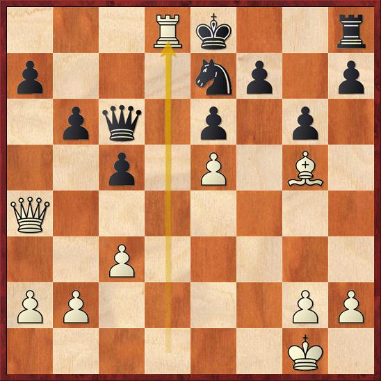

# Chess Tactics

## Introduction

Chess is a visual game. A chess player must be able to recognize elementary patterns, therefore the tactics in this sections will be primarily explained graphically. This approach is supported by a large numbers of diagrams, which will also allow the reader to study tactics without a chessboard. 

Chess is also a game of logic. Logic, in the same way as chess tactics, depends on collecting and processing information. This section will show you how to accurately find the elements of tactics, and work with them creatively. 

## Content

1. [Pins](https://mmu-chess-club.gitbook.io/mmu-chess-club/tactics/pins)
2. [Back Rank Combinations](https://mmu-chess-club.gitbook.io/mmu-chess-club/tactics/back-rank-combinations)
3. [Knight Forks](https://mmu-chess-club.gitbook.io/mmu-chess-club/tactics/knight-forks)
4. [Double Attacks](https://mmu-chess-club.gitbook.io/mmu-chess-club/tactics/double-attacks)
5. [Discovered Checks](https://mmu-chess-club.gitbook.io/mmu-chess-club/tactics/discovered-attacks)
6. [Double Checks](https://mmu-chess-club.gitbook.io/mmu-chess-club/tactics/double-checks)
7. [Discovered Attacks](https://mmu-chess-club.gitbook.io/mmu-chess-club/tactics/discovered-attacks-1)
8. [Skewers](https://mmu-chess-club.gitbook.io/mmu-chess-club/tactics/skewers)
9. [Double Threats](https://mmu-chess-club.gitbook.io/mmu-chess-club/~/edit/drafts/-LRm5zuCvwbGBp-GFaYx/tactics/double-threats)
10. [Promoting Pawns](https://mmu-chess-club.gitbook.io/mmu-chess-club/tactics/promoting-pawns)
11. [Removing The Guard](https://mmu-chess-club.gitbook.io/mmu-chess-club/tactics/removing-the-guard)
12. [Perpetual Check](https://mmu-chess-club.gitbook.io/mmu-chess-club/tactics/perpetual-check)
13. [Zugzwang](https://mmu-chess-club.gitbook.io/mmu-chess-club/tactics/zugzwang)
14. [Stalemate](https://mmu-chess-club.gitbook.io/mmu-chess-club/tactics/stalemate)

