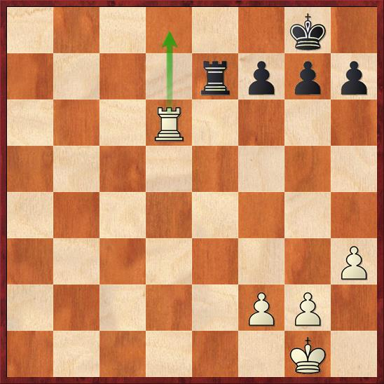

# 2.Back Rank Combinations

## Definition

 In chess, a back-rank checkmate \(also known as the corridor mate\) is a checkmate delivered by a rook or queen along a back rank \(that is, the row on which the pieces \[not pawns\] stand at the start of the game\) in which the mated king is unable to move up the board because the king is blocked by friendly pieces \(usually pawns\) on the second rank \(Burgess 2009:16\). A typical position is shown to the right.

