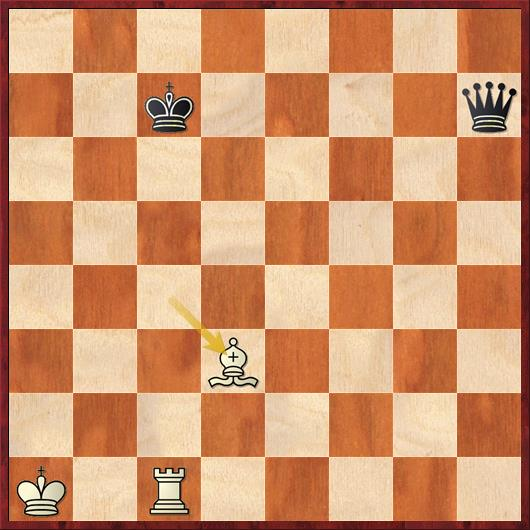

# 5.Discovered Checks

## Definition:

In chess, a discovered attack is an attack revealed when one piece moves out of the way of another. Discovered attacks can be extremely powerful, as the piece moved can make a threat independently of the piece it reveals. Like many chess tactics, they succeed because the opponent is unable to meet two threats at once. While typically the consequence of a discovered attack is the gain of material, they do not have to do this to be effective; the tactic can be used merely to gain a tempo.If the discovered attack is a check, it is called a discovered check.

## Exercises:

[https://lichess.org/study/BnSililj](https://lichess.org/study/BnSililj)

