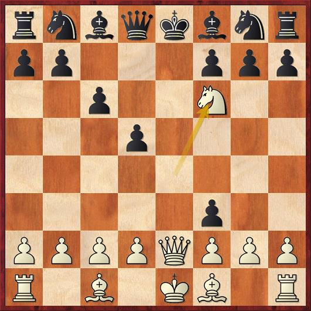

# 6.Double Checks

## Definition:

In chess, a double check is a check delivered by two pieces simultaneously. In chess notation, it is almost always represented the same way as a single check \("+"\), but is sometimes symbolized by "++" \(however, "++" is also sometimes used to denote checkmate\).

## Exercise:

[https://lichess.org/study/EVXFnghL](https://lichess.org/study/EVXFnghL)

