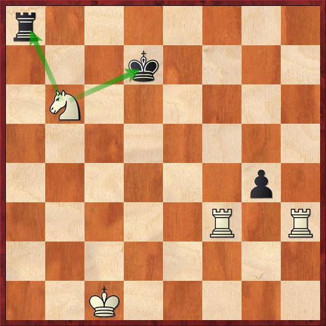

# 3.Knight Forks

## **Definition:**

In chess, a fork is a tactic whereby a single piece makes two or more direct attacks simultaneously. Most commonly two pieces are threatened, which is also sometimes called a double attack. The attacker usually aims to gain material by capturing one of the opponent's pieces. The defender often finds it difficult to counter two or more threats in a single move. The attacking piece is called the forking piece; the pieces attacked are said to be forked. A piece that is defended can still be said to be forked if the forking piece has a lower value.

Besides attacking pieces, a target of a fork can be a direct mating threat \(for example, attacking an unprotected knight while simultaneously setting up a battery of queen and bishop to threaten mate\). Or a target can be an implied threat \(for example, a knight may attack an unprotected piece while simultaneously threatening to fork queen and rook\).

Forks are often used as part of a combination which may involve other types of chess tactics as well.

## **Exercises:**

[https://lichess.org/study/0li1tXRi](https://lichess.org/study/0li1tXRi)

