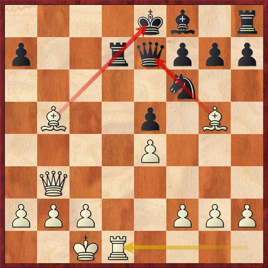

# 1.Pins

### Definition

A pin is a move that inhibits an opponent piece from moving, because doing so would expose a more valuable \(or vulnerable\) piece behind it. Only bishops, rooks, and queens can perform a pin, since they can move more than one square in a straight line. If the pinned piece cannot move because doing so would produce check, the pin is called absolute. If moving the pinned piece would expose a non-king piece, the pin is called relative.

### Exercises



